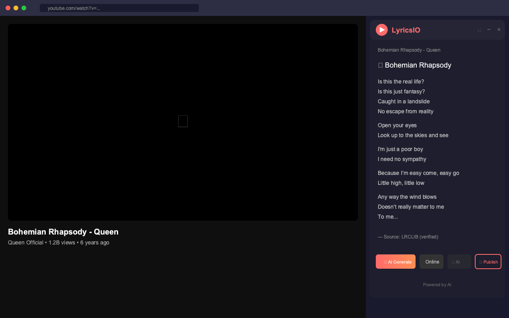

# 🎵 LyricsIO

**See lyrics for any YouTube music video** — with AI-powered generation and karaoke mode.

<p align="center">
  
</p>

## ✨ Features

| Feature | Description |
|---------|-------------|
| 🎵 **Auto-detect** | Automatically identifies songs and fetches lyrics |
| 🤖 **AI Generate** | Generate lyrics from audio when none are found |
| 🎤 **Karaoke Mode** | Synced lyrics overlay that follows the music |
| 📤 **Publish** | Contribute lyrics to help the community |
| 🌍 **7 Languages** | EN, ES, PT, FR, DE, ZH, IT |
| 🎨 **Beautiful UI** | Modern draggable panel with dark theme |

## 🚀 Installation

### Chrome Web Store

<a href="https://chromewebstore.google.com/detail/pjbekbmngleneipdjdbggmfjnmdipboe">
  
</a>

### From Source (Developer Mode)

1. Clone this repository
   ```bash
   git clone https://github.com/rogeriobatista/lyricsio.git
   ```
2. Open Chrome → `chrome://extensions/`
3. Enable **Developer mode** (top right)
4. Click **Load unpacked** → select the `lyricsio` folder
5. Done! The extension icon appears in your toolbar

## 📖 How to Use

1. **Play any music video** on YouTube
2. **Lyrics appear automatically** in a panel on the right
3. **No lyrics found?** Click `AI Generate` to transcribe from audio
4. **Enable Karaoke** for synced lyrics overlay on the video

### Panel Controls

| Button | Action |
|--------|--------|
| ↻ | Refresh lyrics |
| − | Minimize panel |
| × | Close panel |
| 🎤 AI Generate | Generate lyrics from audio |
| Online | View lyrics from database |
| 🎤 AI | View AI-generated lyrics |
| 📤 Publish | Share lyrics with others |

## 🔧 Settings

Click the extension icon to access settings:

- **Language** — Choose from 7 supported languages
- **Auto-detect songs** — Automatically fetch lyrics on video change
- **Show lyrics panel** — Toggle panel visibility
- **Synced lyrics overlay** — Enable karaoke mode

## 🛠️ How It Works

```
YouTube Video → Song Detection → LRCLIB Search → Display Lyrics
                                      ↓
                              Not Found?
                                      ↓
                         AI Generate (Groq Whisper) → Synced Lyrics
                                      ↓
                              Publish to LRCLIB
```

1. **Detects** the song from YouTube video title
2. **Searches** LRCLIB for verified lyrics
3. **Falls back** to AI audio transcription if not found
4. **Displays** lyrics with optional karaoke sync
5. **Publishes** AI-generated lyrics to help others

## 🌐 Supported Languages

| Flag | Language | Code |
|------|----------|------|
| 🇺🇸 | English | en |
| 🇪🇸 | Spanish | es |
| 🇧🇷 | Portuguese | pt |
| 🇫🇷 | French | fr |
| 🇩🇪 | German | de |
| 🇨🇳 | Chinese | zh |
| 🇮🇹 | Italian | it |

## 🔒 Privacy

- ✅ No personal data collected
- ✅ No tracking or analytics
- ✅ All settings stored locally
- ✅ Open source

See our [Privacy Policy](https://rogeriobatista.github.io/lyricsio/privacy-policy.html)

## 🧪 Development

```bash
# Install dependencies
npm install

# Run tests
npm test
```

## 📝 License

MIT License — feel free to modify and distribute!

## 🤝 Contributing

Contributions welcome! Feel free to open issues and pull requests.

---

<p align="center">
  Made with ❤️ for music lovers
  <br>
  <strong>Powered by AI</strong>
</p>
